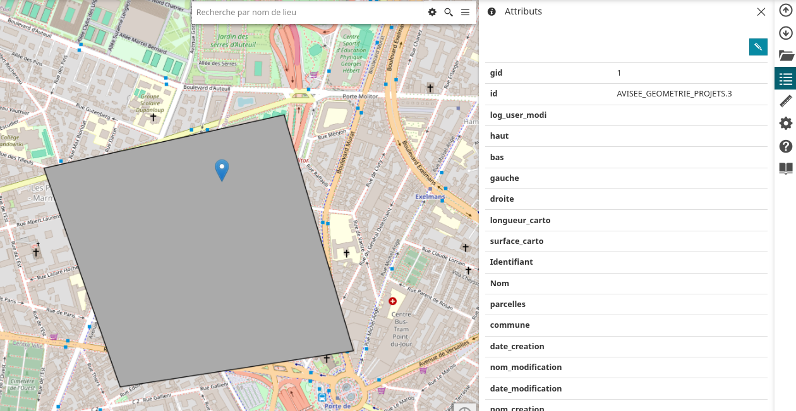

# Sommaire du guide utilisateur

Le guide utilisateur du plugin `panel_editor` est organisé en 3 parties :

- **Présentation**: [Vue globale](global_overview.md)
- **Configuration**: [Prendre en main](getting_started.md)
- **Restrictions par rôles**: [Barres ou menus d'outils](tools.md)

Ce plugin simplifie l'affichage des attributs des entités affichées sur la carte.
Il ne reemplace pas l'outil attributaire natif de MapStore2 mais permet de le simplifier et d'améliorer l'affichage des attributs pour un public plus large.

Il affiche les entités identifiées sur la carte, permet de passer en mode édition et applique les règles de droits définies dans la configuration, par un administrateur.

